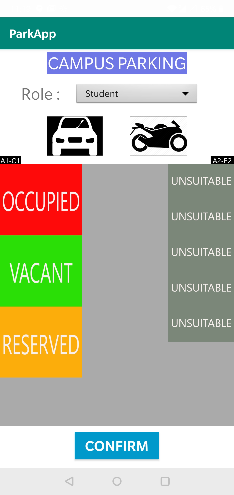
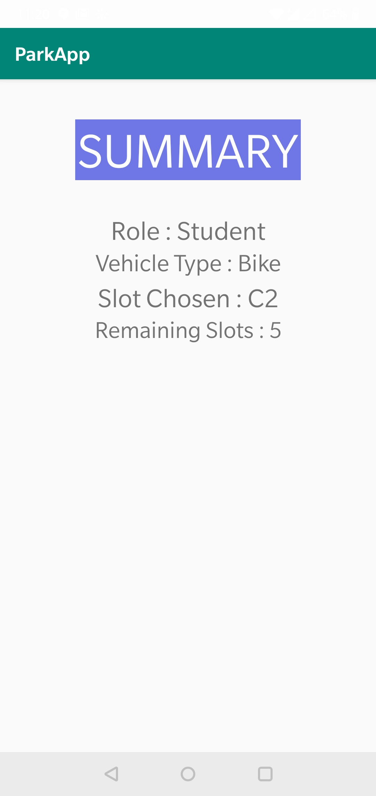

# ParkApp
Application for College Parking

Operation:-
Step 1: Choose role, vehicle type and select an appropriate slot

Step 2: Once confirmed the summary details are shown

Instructions:
Copy the mainactivity code in the starting activity, the second one can be copied in any other
Create resource directorys for drawable-ldpi,mdpi,ldpi,hdpi,xhdpi,xxhdpi and xxxhdpi and copy the image resources from files of same name
Build the project and run it on any android device
The app has been made responsive with guidelines and constraintlayout so it will work even on 4" screens.

Documentation:
The mainactivity uses a spinner for selecting role and buttons for the vehicle types. There are buttons for each slot which are programmed to allow selection or not based on vehicle selected and role selected.Once selected only can the user confirm, after which a summary is provided of the activity in a new activity.TextViews are used for details which are set based on information provided. Backpress leads back to the mainactivity. 
